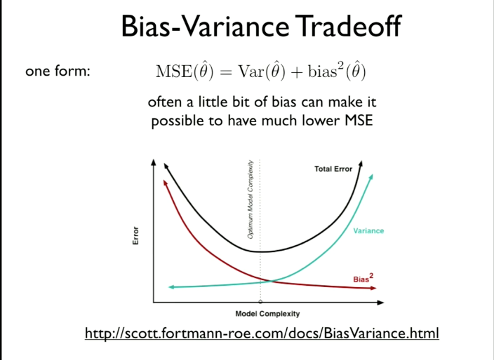

# [Bias and Regression - Harvard CS109](https://matterhorn.dce.harvard.edu/engage/player/watch.html?id=afe70053-b8b7-43d3-9c2f-f482f479baf7)

## [part 1 slides](https://github.com/cs109/2015/blob/master/Lectures/07-BiasAndRegression.pdf)

## [part 2 slides](https://github.com/cs109/2015/blob/master/Lectures/08-RegressionContinued.pdf)

Understanding Bias
- You can have the fanciest math and regression model in the world but if there is an underlying bias in your data and you don't know why, it is all for not.
- Always take time to understand what the variables mean.
- Forms of bias
    - Selection Bias
        - How did you come by your data? What values are included? What values are not included?
    - Publication bias (File drawer problem)
        - Only those with significant results get to publish their results. How reliable and reproducible are those results?
    - Non-response bias
        - In a survey, how do we know that those who did not respond don't hold a very different view.
    - Length bias
        - 
### Selection and Non-response Bias

In the 1936 election between Rosevelt and Langdon, Reader's Digest surveyed 2.3 Million Americans to see who would win the election. They estimated that Langdon would win by a landslide based on the survey results. They were horribly wrong. Why?

2.3 out of 10 Million responded. What about the remaining 7.7 Million Americans that did not complete the survey?

They asked (1) their own readership, (2) vehicle ownership list, (3) phone directory. A very biased collection of wealthy Americans.

## [Abraham Wald - 'The Father of Decision Theory'](https://en.wikipedia.org/wiki/Abraham_Wald)

During WWII he was contracted to analyze the Allied Aircraft. Which areas of the planes need more armour?

- He analyzed the bullet holes on the planes returning and made his decision:
    - You should put the armour were you don't see the bullet holes because the planes that did not come back are the ones that were shot down.
    - The analysis group are the ones that survived.
    
## Longevity Study from Lombard (1835)

- Lombard collected data on a number of professions and found the average life expectancy of those professionals. What he found in the results were quite alarming but what he later realized is that he was subject to selection bias. He had not accounted for the mobility of professions or the fact that individuals tend to leave certain professions at different times in their lives.

## Class Size Paradox - length bias

- Why is it that when you look at the marketing literature for post secondary class sizes you see small class sizes? When you arrive there are far more large classes.
- Perspective matters
    - Each student takes one course. Suppose there is one course with 100 students and 50 courses with 2 students
    - The Dean might publish `(100 + 50 * 2)/51 = 3.92`
    - The students would notice `(100 * 100 + 100 * 2)/51 = 51`
    
## Inmates

- "10% of the 1.6 million inmates in the American prison system are serving life sentences; another 11% are serving over 20 years."
    - How would you measure the average prison sentence?
    - If you go to a prision to interview the inmates, you will likely only intersect or interview with those who have long prison sentences.

## Bias of an estimator

let A = 𝛉

- bias(Â) = E(Â) - A
- The bias of an estimator is how far off is the estimator from the true mean.

## Bias-Variance Tradeoff

- When you get in the habit of looking for it, you will find it everywhere in statistics and machine learning
- **One Form:** MSE(Â) = Var(Â) + bias^2(Â)
    - MSE = Mean Square Error
    - Minimizing bias seems like a nobel case but we rarely know the true bias of A (the population or truth).
    - A much more meaningful pursuit is minimizing MSE (mean square error).
    - We want to be as close to the truth, on average, as possible.
    - Often we can trade a little bit of bias for a much lower MSE
    

## Fisher Weighting

- How should we combine independent, *unbiased* estimators for a parameter into one estimator?
- We rarely or never have a perfectly structured dataset that works to estimate our parameter.
    - We clean, restructure, augment with additional data, and wrangle the orginal sample to find a useful model.
- [Ronald Fisher](https://en.wikipedia.org/wiki/Ronald_Fisher) may be the greatest statistician of all time
- 
- The weights should sum to one, but how should they be chosen?
    - It makes sense that we should weight the reliable sources more heavily. i.e. Higher variance is less reliable.
    - Fisher found the most reliable way to assign weighting is inversely to the variance

## Nate Silver Weighting [Method](http://fivethirtyeight.com/features/how-the-fivethirtyeight-senate-forecast-model-works/)

- Exponential decay based on the recency of the poll
    - There is no magic mathematical process for choosing the weighting based on the age of the poll. He just worked at the problem and generated test after test until he began optimizing accuracy.
- sample size of the poll
    - This is an easy area to focus on because of its direct and well known implications on variance and reliability
- Pollster rating
    - He delved deep into the past election data and rated the pollsters on their previous performance.

## Multiple Testing - Bonferroni

- How should we handle p-values when testing multiple hypotheses?
- Example: What if we are looking at diet (with 10 kinds of food) and disease (with 10 diseases)?
- This is a famous issue (fishing expedition):
    - If you have many variable and continually look at multiple hypotheses you are bound to find something that is correlated. Even though there is no underlying correlation.
    - You will probably find a low p-value
- A simple, conservative approach is [Bonferroni Correction](https://en.wikipedia.org/wiki/Bonferroni_correction): divide significance level by number of hypotheses being tested
[Equation](https://wikimedia.org/api/rest_v1/media/math/render/svg/fdab57bcb528409d7df01df1122e7db7d922456c)

- This means that we maintain our value of alpha (significance level)

## Regression Toward the Mean (RTTM)

Examples are everywhere:

- Test scores
- Sports
- Inherited characteristics, e.g., heights
- Traffic accidents at various sites
- Consider: all human activities that seek a level of sophistication or accuracy are based on **skill** and **luck** (you can attempt to control one and have no influence over the other)

## Regression Paradox

**Standardized quantity** - Rescaled and recentered the data so that both `x` and `y` have mean=0 and std=1. Take all the x values and subtract the overall mean from them and divide by the standard deviation.

Regression line: predict y = rx; think of this as a weighted average of the parent's height and the mean.

Mathematically you may conclude:

    y = rx    and therefore.   x = y / r
    Statistically this is incorrect because r is the correlation
    between x and y.
    Therefore    y = rx    and    x = ry    are both correct.
    
This is still RTTM.

## Linear Model

often called 'OLS' (ordinary least squares)(a specific criteria), but that puts the focus on the procedure rather than the model.

To keep things logical, do not avoid matrix notation:

y = Xβ + ϵ

n is the number of observations
X is the matrix of data
β is the parameters
k is the number of predictor variables
ϵ is the error

Linear refers to the fact that we are taking linear combinations of the predictors. Still linear if, e.g., use both x and its square and its cube as predictors.

In traditional statistics, it is assumed that n > k, however in modern big data problems, this gets flipped. i.e. when considering 100 test subjects and an investigation of their entire DNA sequencing.

### Sample Quantities vs. Population Quantities

[Gauss-Markov Theorem](https://en.wikipedia.org/wiki/Gauss–Markov_theorem)

## Residuals

**_always plot the residuals_** (Plot residuals vs. fitted values, and residuals vs. each predictor variable)

[Free Recommended Book on Residuals](https://cran.r-project.org/doc/contrib/Faraway-PRA.pdf)

## "Explained" Variance

- variance decompositions

- R^2 measures goodness of fit, but it does not validate the model. Adding more predictors can only increase R^2.

**How useful is your model as a predictor?** R^2 is not a terrible predictor. It is a decent measure of fit within your sample but not good at all when considering future data. With more predictors, R^2 will continue to climb in value.

# Part 2

## Collinearity

- Should avoid having predictor variables that are highly correlated with each other (collinearity results in instability, high variances in estimates, and worse interpretability)

- An extreme case of collinearity would be also including a Bronx indicator in the NYC Housing example. Instead, use one borough as a baseline.

- *The ideal case is when the predictor variables are approximately uncorrelated with eachother but highly correlated with the thing you are trying to predict.*

## Predicting a Binary Response

- Linear regression is particularly good at predictions with continuous random variable. 
- Binary discrete variables pose a problem for a linear model

## Logistic Regression

- Logistic Regression is a way to work with binary discrete variables.

[An Introduction to Statistical Learning](http://www-bcf.usc.edu/~gareth/ISL/) is a free book with great resources for Machine Learning.

#### What about confounding factors?

- We can set up a logistic regression model to predict the odds of a particular outcome, given the predictor variables.

- We can also use this to compare one group vs. another group, controlling for the other predictors.

- Then we can use the data to estimate the parameters, using Maximum Likelihood Estimation (MLE).

If you just keep adding confounding variables/parameters you will need to understand:

## Curse of Dimensionality

- For a uniform random point in a box with side length 2, what is the probability that the point is in the unit ball?

#### A geometric representation:

- People's intuition is not very good when it comes to estimating dimensionality. Moving from 2D to 3D is very difficult for a person's intuition — for example.

#### Curse of Dimensionality Example:

- For a uniformly random point in the box in d dimensions with length 2 in each dimension, what is the probability that the random vector is in the unit ball in d dimensions?

<table width=400 align="left">
  <tr>
    <th>d</th>
    <th>probability</th>
  </tr>
  <tr>
    <td>2</td>
    <td>0.79</td>
  </tr>
  <tr>
    <td>3</td>
    <td>0.52</td>
  </tr>
  <tr>
    <td>6</td>
    <td>0.08</td>
  </tr>
  <tr>
    <td>10</td>
    <td>0.002</td>
  </tr>
  <tr>
    <td>15</td>
    <td>0.00001</td>
  </tr>
  <tr>
    <td>100</td>
    <td>1.87•10^-70</td>
  </tr>
</table>

- 10 variables is not that big, even before the concept of big data.

- Most statistical methods were developed for finding the average or the typical. In high dimensionality, the typical cases are very few and the fringe cases are the norm.

- In high dimensionality you frequently have to rely on extrapolation because there are not enough close data points to interpolate.

- This is also a problem with **nearest neighbours** methods in high dimensionality.

Andrew Gelman's rebuttal to the 'curse of dimensionality' [The blessing of dimensionality](https://andrewgelman.com/2004/10/27/the_blessing_of/)

- In big data, are you discussing tall data or wide data

- Wide data is where linear regression breaks down and we need to use different methods:

# Modern Algorithms:

## Ridge Regression and Shrinkage

- In a linear regression model, inplace of minimizing the sum of squared residuals, ridge regression says to minimize

[Ridge Regression](https://en.wikipedia.org/wiki/Tikhonov_regularization)

##### Shrinkage Estimation

[Stein's Paradox](https://en.wikipedia.org/wiki/Stein%27s_example)

- It was proven that seemingly independent problems are better analyzed together than separately.

- [Bradley Efron](https://en.wikipedia.org/wiki/Bradley_Efron) developed the bootstrap method
- [Carl Morris (statistician)](https://en.wikipedia.org/wiki/Carl_Morris_(statistician))
    - They set out to prove that the Stein Paradox is useful for data analysis

## LASSO and Sparsity

In a linear regression model, in place of minimizing the sum of squared residuals, LASSO says to minimize

This helps induce sparsity, deducing the number of variables one has to deal with.

Examples from [Introduction to Statistical Learning](http://www-bcf.usc.edu/~gareth/ISL/)
