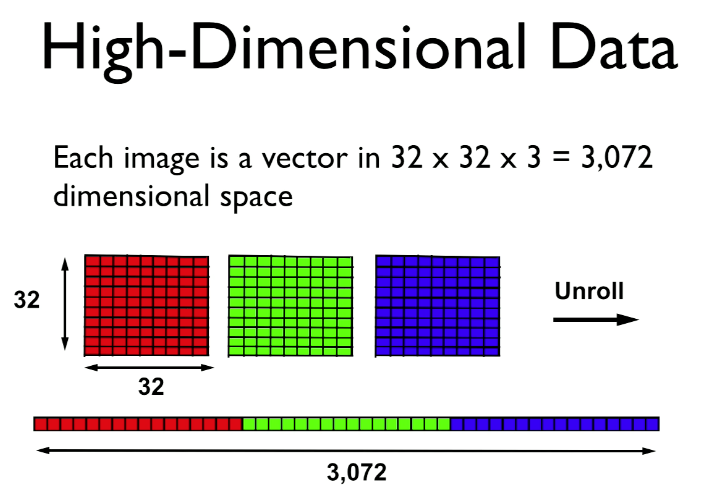
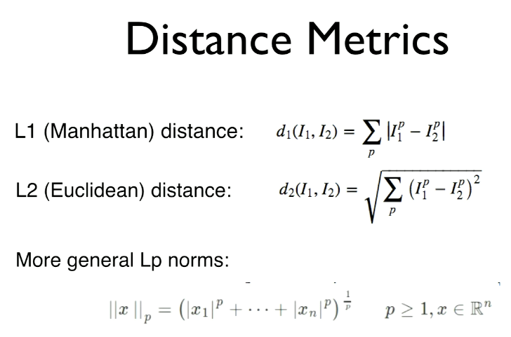
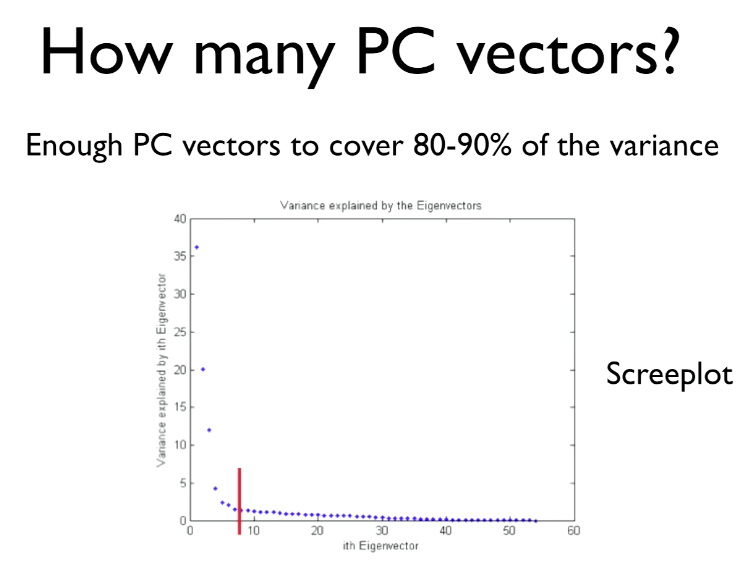

# Classification, kNN, Cross-validation, Dimensionality Reduction

# [presentation slides](https://github.com/cs109/2015/blob/master/Lectures/09-ClassificationPCA.pdf)

## [CS 109 Classification & PCA](https://matterhorn.dce.harvard.edu/engage/player/watch.html?id=c322c0d5-9cf9-4deb-b59f-d6741064ba8a)

## Classification

In the simplest form:

- We start with data
- We add labels

[MIT Scene Recognition Demo](http://places.csail.mit.edu/demo.html)

- Uses data as input
- references a large labeled database to make inferences
- Machine learning have become exceedingly good at image classification
- kNN (k-Nearest Neighbours Classification)

# Machine Learning

Fundamentally:

- Input: A **training set** of N data points, each labeled with one of K different classes.
- Learning: Use the training set to learn what every one of the classes looks like.
- Evaluation: Predict labels for a **test set** of data and compare the true labels (ground truth) to the ones predicted by the classifier.

## Supervised learning

- Examples: kNN, SVM, Decision Trees, Random Forests, Bagging, Boosting, etc.
- Make predictions for new data points
- Data has labels (categories)

## Unsupervised learning

- Examples: PCA, MDS, Clustering, etc.
- Find patterns in the data
- Data has no labels

In Machine Learning we are looking for the **decision boundry** between our classifications. Data points are generally labelled as `x` and labels are `y`

These datasets can exist in high dimensional space and the space is spand by **features**

## Feature Selection

- If trying to classify Apples and Oranges based on roundness and weight you would have a near impossible task

- If you choose colour and shape as your features then the classes begin to segregate more easily.

    More of an art than a science

# Nearest Neighbour Classifier

- Essentially a lookup

- Predict class of new data point by majority vote of K nearest neighbours

- K is primarily an odd number so that their is a clear winner

- [Voronoi diagram](https://en.wikipedia.org/wiki/Voronoi_diagram)

I-NN Properties (One Nearest Neighbour):

- Simple and quite good for low dimensional data
- "Rough" decision boundary, may have "islands"
- Training complexity for N data points? order 1
- Test complexity for M data points? N • M
- Error on training set? zero (always finding the NN)
- Variance? Bias?
    - The variance is quite high because for each new training set I get a new decision boundary
    - The bias is quite low because, on average, the tests do quite well
    - To reduce the variance we are going to increase the number of neighbours
    
- As we increase k, variance will decrease but the bias will potentially increase.

- **How do we choose the ideal k?**

## Cross Validation

- You split your data into a training set and a test set. Then you use your training set to evaluate your test set for performance.

- k is a hyper parameter

- How many datapoints need to move to the training and test?

- How do we define the distance function for nearest neighbours?

- Pick the k with the lowest test error

- We don't want to use all our training data to test the testing data because, statistically speaking, this is a single sample size. Therefore we divide our traning data into folds:

- Training data: train classifier
- Validation data: estimate (hyper) parameters (k) (one of the training folds)
- Test data: measure performance
    
#### Process:
    1. Iterate over choice of validation fold
    2. For all parameter values:
        1. Train with training data
        2. Validate with validation data
    3. Average the parameters with best performance of validation data
    
- 5 fold and 10 fold are typical numbers for training/validation but it comes down to intuition and experience for a particular classifier.

## The test data is NOT used to determine the parameters

- do not touch your test data until the very end.

### More Process:

1. Take best parameters
2. Train on training data and validation data together
3. Test performance on test data

#### Evaluate on the test set only a single time, at the very end.

- The results will not be generalisable

3,072 dimensions

## Optimization

- To improve the accuracy we need to consider new **features** (other than pixel vectors)

- Our most sophisticated feature analysis for images is based on neural network algorithms.

## Why don't we just use more and more features?

- Curse of Dimensionality

- When dimensionality increases, the volume of the space increases so fast that the available data becomes sparse

- Statistically sound result requires the sample size N to grow exponentially with d

## What can we do?

- We can try to work the problem down into a lower dimensional form:

# Dimensionality Reduction

- We are trying to maintain the distance

#### Basically

- Project the high-dimensional data onto a lower-dimensional subspace that best "fits" the data.

- Many methods are linear projections

### Does the data lie mostly in a hyperplane? If so, what is its *intrinsic* dimensionality d?

# PCA (Principal Component Analysis)

- We want to choose our principal components such that we minimize orthogonal distances

v: chosen to minimize orthogonal distances

Equivalent: v is the direction of maximum variance (max. the spread along v)

## Algorithm

1. Substract mean from data (center X)
2. (Typically) scale each dimension by its variance
    1. Helps to pay less attention to magnitude of dimensions
3. Compute covariance matrix S
4. Compute k largest eigenvectors of S
5. These eigenvectors are the k principal components

The PCA will tell you the intrinsic dimensionality of your dataset

There is a simple formula for the variance that each eigenvector explains

# MDS Multi-dimentional Scaling

## A different goal

- Find a set of points whose pairwise distances match a given distance matrix.

- Given n x n matrix of pairwise distances between data points
- Compute n x k matrix X with coordinates of distances with some linear algebra magic
- Perform PCA on this matrix X
